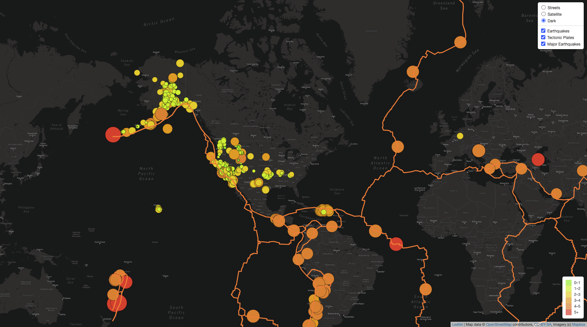

# Mapping_Earthquakes

## Purpose
The purpose of this project is to visually show the differences between the magnitudes of earthquakes all over the world for the last seven days.

## Tasks
To complete this project, GeoJSON earthquake data from the USGS website was used to retrieve geographical coordinates and the magnitudes of earthquakes for the last seven days. Then add the data to a map.

## Approach
Using the JavaScript and the D3.js library to retrieve the coordinates and magnitudes of the earthquakes from the GeoJSON data. Utilizing the Leaflet library to plot the data on a Mapbox map through an API request and create interactivity for the earthquake data.

## Results
An interactive map that allows you to change map styles, while also looking at earthquakes, major earthquakes and techtonic plate activity recorded within the past 7 days. 

